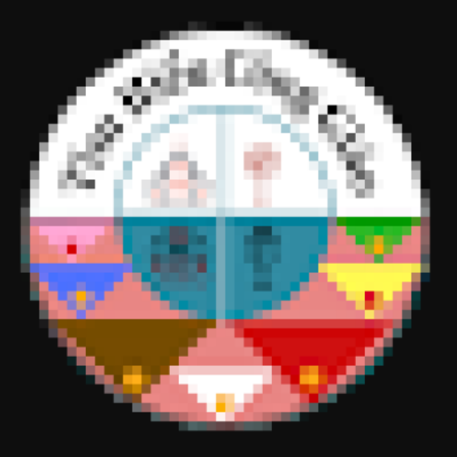

# 🎓 NỀN TẢNG GIẢI ĐÁP THẮC MẮC SINH VIÊN

## 📖 Giới thiệu
Trong thời đại công nghệ số, nhu cầu trao đổi thông tin và giải đáp thắc mắc của sinh viên ngày càng tăng cao. Tuy nhiên, nhiều sinh viên gặp khó khăn trong việc tìm người hỗ trợ hoặc ngại liên hệ trực tiếp với các phòng ban.

👉 Dự án này được xây dựng nhằm:
- Hỗ trợ sinh viên đặt câu hỏi nhanh chóng
- Kết nối trực tiếp với các phòng ban
- Tạo môi trường trao đổi minh bạch, tiện lợi
- Đáp ứng xu hướng chuyển đổi số trong giáo dục

---

## 🚀 Tính năng chính

### 👨‍🎓 Đối với sinh viên
- Đăng tải thắc mắc
- Xem thông báo từ nhà trường
- Tham gia diễn đàn
- Nhắn tin riêng với phòng ban

### 🏫 Đối với phòng/khoa/viện
- Quản lý thông báo
- Trả lời thắc mắc trên diễn đàn
- Xử lý tin nhắn riêng
- Xem thống kê

### ⚙️ Đối với Admin
- Quản lý diễn đàn
- Quản lý danh mục
- Xử lý báo cáo vi phạm
- Quản lý thắc mắc

---

## 🛠️ Công nghệ sử dụng

| Thành phần        | Công nghệ |
|------------------|----------|
| Ngôn ngữ         |  |
| Framework        |  |
| JDK              |  |
| Cơ sở dữ liệu    |  |
| Build Tool       |  |

---

## ⚙️ Cài đặt & chạy dự án

### 1. Clone project
```bash
   git clone https://github.com/nguyenvutriet/UTE_GiaiDapThacMac.git
```
### 2. Build  project
```bash
    mvn clean install
 ```
### 3. Cấu hình  ``` application.propertise ```
 ```bash 
    # Spring Datasource
    spring.datasource.url=jdbc:mysql://localhost:3306/<name_db>
    spring.datasource.username=<your_ussername>
    spring.datasource.password=<your_password>

    spring.jpa.hibernate.naming.physical-strategy=org.hibernate.boot.model.naming.PhysicalNamingStrategyStandardImpl

    # Spring Security OAuth2 Client Configuration for Google
    spring.security.oauth2.client.registration.google.client-id=<your_client_id>
    spring.security.oauth2.client.registration.google.client-secret=<your_secret_id>

    # Spring Mail Configuration
    spring.mail.host=smtp.gmail.com
    spring.mail.port=587
    spring.mail.username=<your_email>
    spring.mail.password=<your_password_app>
    spring.mail.protocol=smtp
    spring.mail.properties.mail.smtp.auth=true
    spring.mail.properties.mail.smtp.starttls.enable=true

    spring.servlet.multipart.max-file-size=20MB
    spring.servlet.multipart.max-request-size=20MB

    # Folder upload
    app.upload.dir=../uploads/
 ```

## 📚 Tài liệu & Demo
- 🌐 Demo: [online-hcmute-edu-vn](https://online-hcmute-edu-vn.duckdns.org/login)
- 🎥 Video demo: [Video]()
- 📄 Tài liệu chi tiết: [document](https://onedrive.live.com/:w:/g/personal/24e5b2f2c6c2d532/IQDRXsXDDHMSQr3G-VRotjA6ARFgyZWLfo-GEf35EY7aG2c?rtime=5vsIet-T3kg&redeem=aHR0cHM6Ly8xZHJ2Lm1zL3cvYy8yNGU1YjJmMmM2YzJkNTMyL0lRRFJYc1hEREhNU1FyM0ctVlJvdGpBNkFSRmd5WldMZm8tR0VmMzVFWTdhRzJjP2U9QzhTSk5P)

📌 Lưu ý: Sử dụng UML để thiết kế hệ thống.

## 📜 Giấy phép
Dự án này là tài sản trí tuệ của nhóm tác giả. Hiện tại, mã nguồn này được công khai với các điều kiện sau:

- 👀 **Quyền xem:** Người dùng có quyền xem và tham khảo mã nguồn cho mục đích học tập.  
- ✏️❌ **Cấm chỉnh sửa:** Không cho phép sao chép, chỉnh sửa hoặc tạo các bản phái sinh khi chưa có sự đồng ý từ nhóm tác giả.  
- 🚫📦 **Cấm phân phối:** Không được phép chia sẻ hoặc tái xuất bản mã nguồn dưới bất kỳ hình thức nào vì mục đích thương mại.  

📩 Mọi yêu cầu sử dụng khác vui lòng liên hệ trực tiếp với nhóm tác giả.

## 👨‍💻 Nhóm tác giả
<table>
  <tr>
    <td align="center">
      <br><br>
      <b><a href="https://github.com/banghoang-hub">Phan Tống Hoàng Bang</a></b><br><br>
    </td>
    <td align="center">
      <br><br>
      <b><a href="https://github.com/NgocHuynh1509">Huỳnh Gia Diễm Ngọc</a></b><br><br>
    </td>
        <td align="center">
      <br><br>
      <b><a href="https://github.com/maiquynhvnlhb-ship-it">Võ Thị Mai Quỳnh</a></b><br><br>
    </td>
        <td align="center">
      <br><br>
      <b><a href="https://github.com/thtra-TT">Phan Thị Thanh Trà</a></b><br><br>
    </td>
        <td align="center">
      <br><br>
      <b><a href="https://github.com/nguyenvutriet">Nguyễn Vũ Triết</a></b><br><br>
    </td>
        <td align="center">
      <br><br>
      <b><a href="https://github.com/thanhtu05">Hoàng Thanh Thú</a></b><br><br>
    </td>
  </tr>
</table>

 


